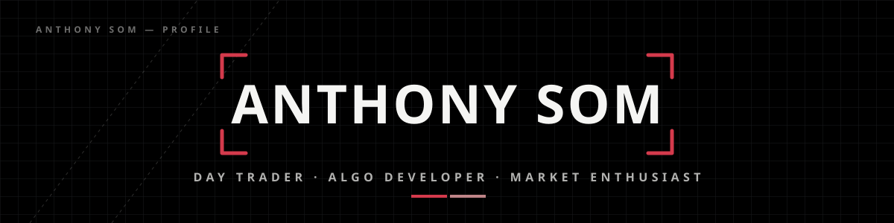

<div align="center">


</div>

## 🚀 Ventures

<table>
  <tr>
    <td align="center" valign="top" width="33%">
      <a href="https://quantumwave.dev"></a>
      <h3>Quantum Wave</h3>
      <sub><b>Founder</b></sub>
      <p>A multi-timeframe stochastic indicator on TradingView that helps traders spot turning points in the market.</p>
      <a href="https://quantumwave.dev"></a>
      <a href="https://www.tradingview.com/script/y0PGB1ww-Quantum-Wave/"></a>
    </td>
    <td align="center" valign="top" width="33%">
      <a href="https://whop.com/quantum-wave/"></a>
      <h3>Quantum Wave v2</h3>
      <sub><b>Founder</b></sub>
      <p>Algo trading that gives retail traders institutional-grade algorithmic access. Its crypto algo, a CNN model, returned <b>+28.5R before fees</b> across 155 out-of-sample trades (May 9 – Sep 25, 2026). It also includes <b>QW-AI</b>, an AI day trader that checks its own parameters before it enters a trade.</p>
      <a href="https://whop.com/quantum-wave/"></a>
    </td>
    <td align="center" valign="top" width="33%">
      <a href="https://www.parabolt.xyz/landing"></a>
      <h3>Parabolt</h3>
      <sub><b>Co-founder</b></sub>
      <p>Builds Synqer, which turns trade alerts posted in Discord into tracked positions and, when you allow it, into orders at your own broker under your risk rules.</p>
      <a href="https://www.parabolt.xyz/landing"></a>
    </td>
  </tr>
</table>

## 👋 About

I trade the markets and write the code behind it: broker connectivity, trade copiers, alert bots, scanners, and automated strategies. I also study Computer Science (Software Engineering) at Toronto Metropolitan University.

## 🎯 Where I'm Headed

- 📈 Trade full-time on a book of systematic strategies that run without me watching the screen
- 🏦 Build and run my own fund or prop desk, backed by research and infrastructure I wrote myself
- ⚖️ Give retail traders the same tools as institutions
- 🤖 Build AI agents that research, execute, and review trades on their own, with a human setting the risk

## 🧰 What I Build

A mix of open-source contributions and private tools I run in my own trading:

```yaml
open_source:   trade journaling, analytics, and broker connectivity
execution:     futures and crypto trade copiers, an options trading bot
research:      backtesting, signal research, and ML models on market data
monitoring:    market scanners, news feeds, and live trade alerts on Discord
tooling:       a personal trading dashboard with AI trade review
```

## 🛠️ Stack

<p align="center">
  
</p>

<p align="center">
  <b>Brokers & Data:</b> Interactive Brokers · Tradovate · moomoo · Tiger · Alpaca · Hyperliquid · Bybit · MEXC · Databento<br/>
  <b>Quant:</b> pandas · NumPy · SciPy · Plotly · TradingView Lightweight Charts<br/>
  <b>AI:</b> Claude API · OpenAI API
</p>

## 📊 Stats

<p align="center">
  
  
</p>

## 💬 Let's Talk

Market structure, execution, automation, or trading infrastructure. My DMs are open.


